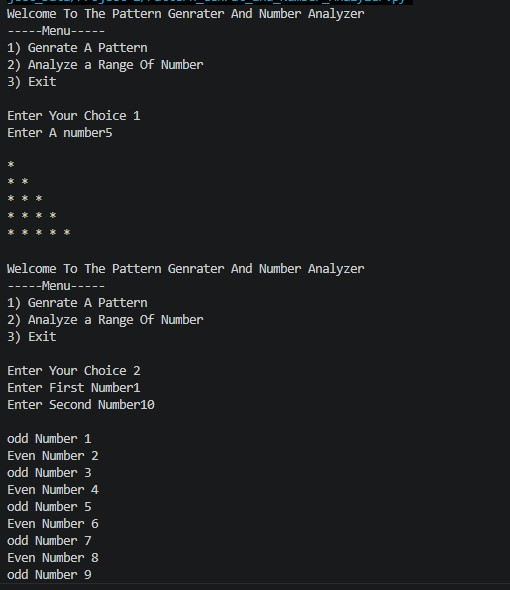
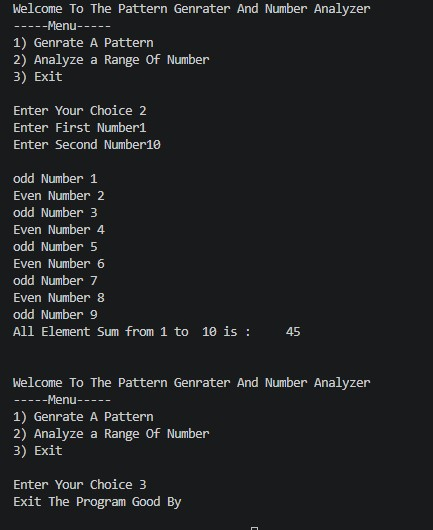

<h1>The Pattern Genrater And Number Analyzer</h1>

<h2>Project Description</h2>

This project is an Interactive The Pattern Genrater And Number Analyzer in which Pattenis Genrate from the user and Number Give The User Input  processed, and then displayed neatly.

<h2>Objectives</h2>

<ul>
<li>Collect data from the user</li>
<li>Process the collected data</li>
<li>Display the results</li>
<li>Demonstrate Python fundamentals</li>
</ul>

<h2>Assumptions</h2>

<ul>
<li>The user will provide valid input</li>
<li>User will be entered in numeric data</li>
</ul>

<h2>Project Structure</h2>

  
project-folder Name/ 
│── Project_2(1).jpg 
│── Project_2(2).jpg 
│── Pattern_Genrated_and_Number_Analyzer.py 
│── README.md

<h2>Output</h2>

<h2>Conclusion</h2>

This project helps in understanding basic Python concepts in a practical way and is very useful for beginners.

